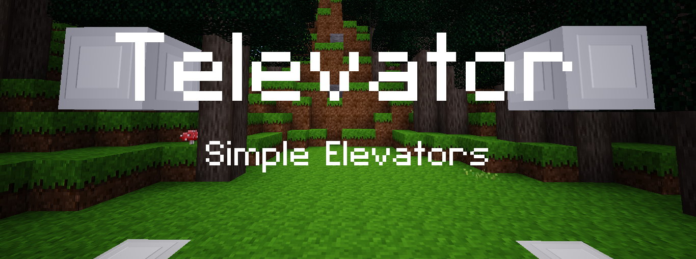

Simple Elevators [televator]
============================
* GitHub: https://github.com/octacian/televator
* Download: https://github.com/octacian/televator/archive/master.zip
* License: MIT (see below for media license)

Televator allows you to create simple elevators in your worlds that work incredibly fast amidst lag and are relatively inexpensive to make. All you need to get started, is to craft an elevator (`televator:elevator`).

Elevator nodes can be placed a maximum of 16 nodes apart. If anything obstructs the space between or there is not 2 blocks of space for the player above the next elevator node, the elevator will not work.

Once standing on an elevator that has other elevators placed with no obstructions above or below it, you can press jump to go up to the next elevator, and sneak to go down the the previous. There are sound effects too! While standing on an elevator you cannot jump normally so as to maintain a consistent feel when ascending and descending.

Televator does not use any entities, but rather teleports the player from elevator to elevator making it suitable for servers that prefer to use only the most efficient mods. This also helps increase general performance for users with less powerful computers or mobile devices, and provides a smooth and consistent feel.

### Recipe

Televator currently only supports Minetest Game items for it's recipe, however, I will gladly add support for other subgames on request. If you are unable to see the picture, please try a different browser such a Chrome/Chromium.

### Media License
Everything not listed here: 
octacian <theoctacian@gmail.com> (CC BY-SA 3.0)

televator_whoosh.ogg (CC BY-SA 3.0): 
- https://opengameart.org/content/whoosh-1