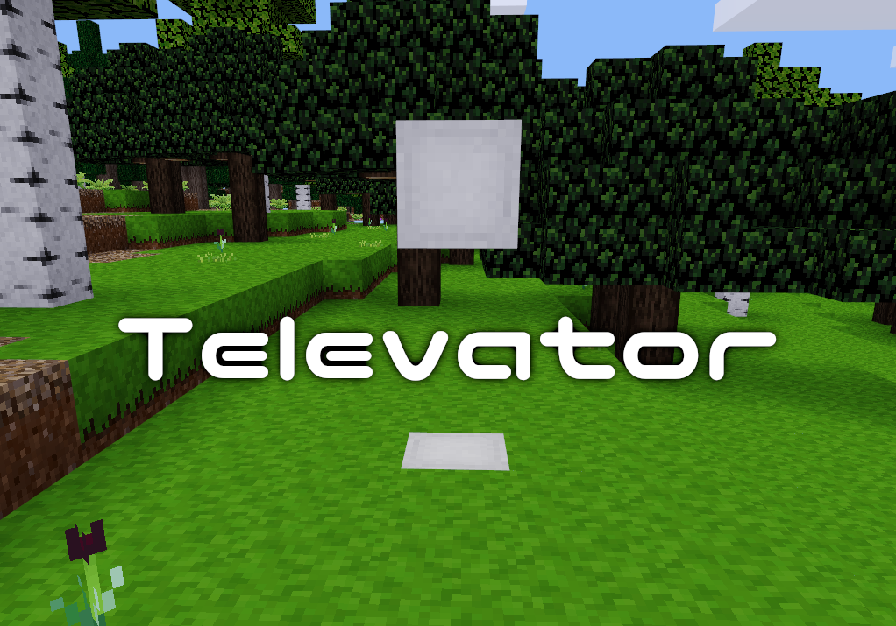
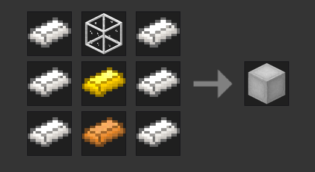

Televator [an_televator]
============================
* GitHub: https://github.com/NoctisLabs/an_televator
* Download: https://github.com/NoctisLabs/an_televator/archive/master.zip
* Forum Thread: https://forum.minetest.net/viewtopic.php?f=9&t=23412
* License: MIT (see below for media license)

Televators are simple elevators that work incredibly fast and are relatively inexpensive to make. Craft a Televator (`an_televator:televator`).

Televator nodes can be placed a maximum of 32 nodes apart. Televators will not work if there is no space for the player. Simply stand on a televator that has another televator node above or below it and press jump to go up and sneak to go down. While standing on a televator you cannot jump.

Televator does not use entities, but rather teleports the player from televator to televator making it suitable for servers that prefer to use only the most efficient mods. This also helps increase general performance for users with less powerful computers or mobile devices, and provides a smooth and consistent feel.

### Media Licenses
televator_whoosh.ogg (CC BY 3.0): 
- https://freesound.org/people/Glaneur%20de%20sons/sounds/34172/

televator_error.ogg (CC BY 3.0): 
- https://freesound.org/people/LorenzoTheGreat/sounds/417794/

televator_televator.png (MIT): 
- https://github.com/OpenMods/OpenBlocks/blob/master/src/main/resources/assets/openblocks/textures/blocks/elevator.png
